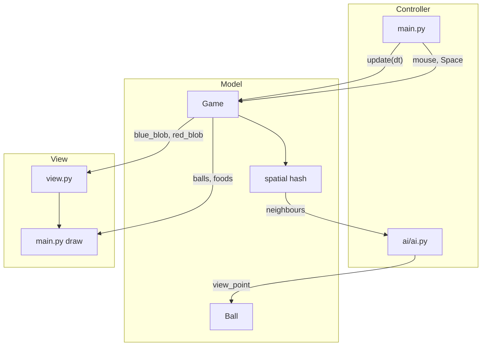

# Архитектура

2D-симуляция Agar.io на Pygame. Разделение **Model / View / Controller**.

## Структура каталогов

```
main.py           # Controller + View: меню, ввод, HUD, игровой цикл
config.py         # все константы
view.py           # отрисовка team blobs (без логики)
game/game.py      # Model: Game, физика, spatial hash, split, spawn
ai/ai.py          # AI: слои intent → view_point
entities/         # Ball, Food, Intent
utils/            # calc_intent, геометрия, тактика команд
tests/            # unit-тесты utils
```

## MVC

| Слой | Файлы | Ответственность |
|------|-------|-----------------|
| **Model** | `game/`, `entities/`, `utils/` | Состояние мира, правила, AI-данные (`TeamBlob`) |
| **View** | `main.py`, `view.py` | pygame: меню, шары, еда, HUD, блобы команд |
| **Controller** | `main.py`, `ai/ai.py` | События (мышь, Space), выбор view_point для шаров |

`Game` не импортирует pygame — отрисовка вынесена в `view.py`.

## Игровой цикл

```
main.run_match()
    │
    ├─► events (Space → split_player_team, клик → меню)
    │
    ├─► Game.update(dt)
    │       ├─ update_team_blobs()     # центр масс команд
    │       └─ для каждого Ball:
    │             update_hash → neighbours
    │             update_ball_status:
    │                 intersections, eats, decay, death
    │                 try_ai_split
    │                 update_ball_pos → ai.ai() → движение
    │
    └─► render: HUD, view.draw_team_blobs, шары, еда, game over
```

## Spatial hash

Карта делится на клетки `CELL_SIZE = 6`.

- `balls_hash` / `food_hash` — `defaultdict(list)` по `(cell_x, cell_y)`
- `get_ball_cells(pos, radius)` — набор клеток, которые пересекает шар
- `update_hash(ball, old_pos, old_radius)` — diff при движении / смене массы
- `get_neighbours(cells)` — кандидаты для столкновений и AI без O(n²)

## AI: pipeline intent

```
neighbours (spatial hash)
    │
    ▼
┌─────────────────────────────────────────┐
│ 5 слоёв intent                          │
│  food    — векторы к еде в зоне видимости│
│  balls   — top-N врагов/союзников       │
│  wall    — отталкивание от границ       │
│  wander  — случайный дрейф              │
│  command — мышь (игрок) или тактика     │
└─────────────────────────────────────────┘
    │
    ▼
_apply_intent_budget   # нормализация по INTENT_WEIGHT_*
    │
    ▼
сглаживание (smooth_add_pos, BALL_INTENT_SMOOTH_STEP)
    │
    ▼
view_point → Ball.normal → speed → новая pos
```

### calc_intent

`merge_factor = CLAMP * tanh(Δradius / EPSILON)` — плавный переход flee/chase без резких скачков.

### Тактики команд (`team_mass_ratio`)

| Режим | Условие | Поведение |
|-------|---------|-----------|
| **defense** | ratio ≥ 1.3 | anchor (крупнейший шар) + спутники на орбите, repulse союзников |
| **neutral** | между порогами | без command; split к удалённому кластеру еды |
| **attack** | ratio ≤ 0.75 | command к врагу, усиленная еда, max split |

## Ключевые механики (Model)

- **Поедание:** центр жертвы внутри круга хищника
- **Decay:** `mass → DECAY_FACTOR^dt`, излишки → еда вокруг шара
- **Split:** `split_ball` — масса пополам; AI split по тактике и карте плотности еды (grid 30×30)

## Диаграмма потока данных


